Documentation
=============

Documenting the suite for different audiences
---------------------------------------------

For operators (1st line)
~~~~~~~~~~~~~~~~~~~~~~~~
The primary documentation for operators is found in the ecFlow manual pages. This documentation should include:

- Step-by-step instructions for common operational tasks.
- Troubleshooting guides for common issues.
- Contact information for 2nd line support - link to oncall page.

For analysts (2nd line)
~~~~~~~~~~~~~~~~~~~~~~~
Analysts will find relevant documentation in both the ecFlow manual pages and the repository README and code.
This should include:

- Detailed descriptions of the suite's functionality.
- Examples of typical analysis workflows.
- Code snippets demonstrating how to interact with the suite programmatically.

For developers
~~~~~~~~~~~~~~
Developers should refer to the repository README and code comments for comprehensive documentation. This should cover:

- Code architecture and design principles.
- Guidelines for contributing to the codebase.
- Detailed comments within the code explaining complex logic and algorithms.

For scientists
~~~~~~~~~~~~~~
Scientists require a high-level description of the suite, which should be documented on a Confluence page.
This should include:

- An overview of the suite's purpose and capabilities.
- Descriptions of key scientific algorithms and models used.
- Links to relevant research papers and technical documentation.

Operators perspective
---------------------
It has to be known that operators who monitor and support our operations 24/7 cannot have full understanding of the operational components that are running. They have limited visibility on the tasks run and can only consult higher level dashboards and GUIs to issue warnings and call out relevant analysts for remediary action. One should keep this into account when designing suites to be as self-explanatory as possible and simple in structure and instructions in the man pages. Here follows a few examples of such dashboards and GUIs.

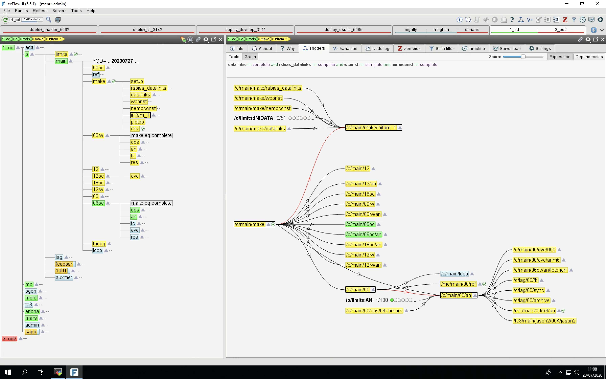

   ecFlow user interface that operators use to monitor and control suite tasks. This is the main interface of interaction during cycle runs 4x a day.
   https://ecflow.readthedocs.io/en/5.13.8/overview.html

   Suite generation software to facilitate building suites.
   https://pyflow-wellies.readthedocs.io/latest/

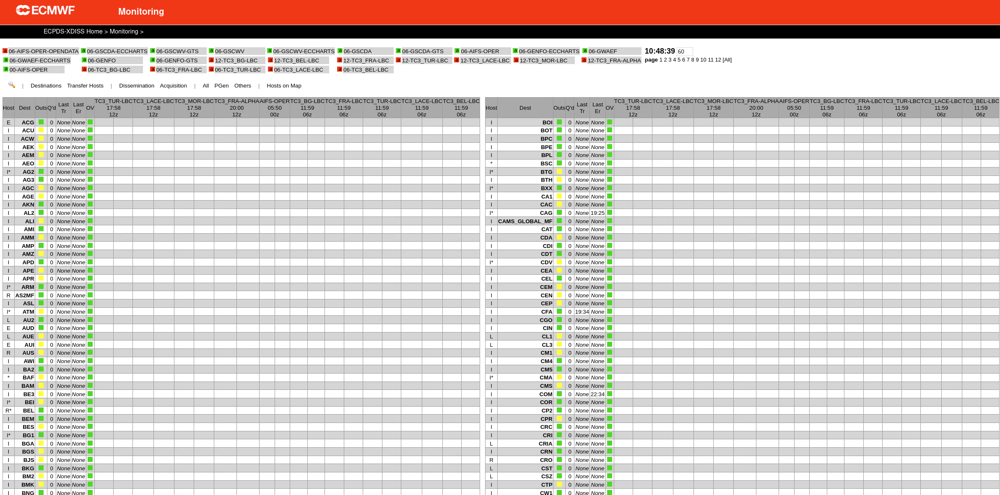

   Specialized view for monitoring XDIS processes.

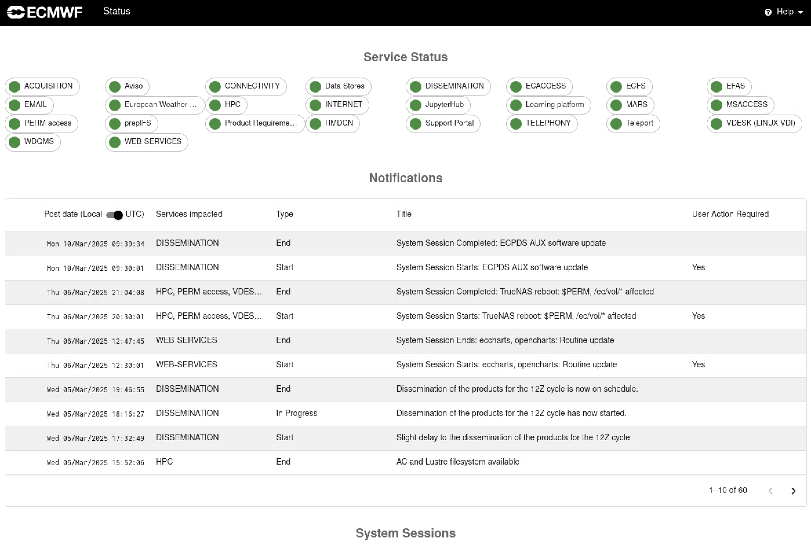

   High-level dashboard for various service statuses.

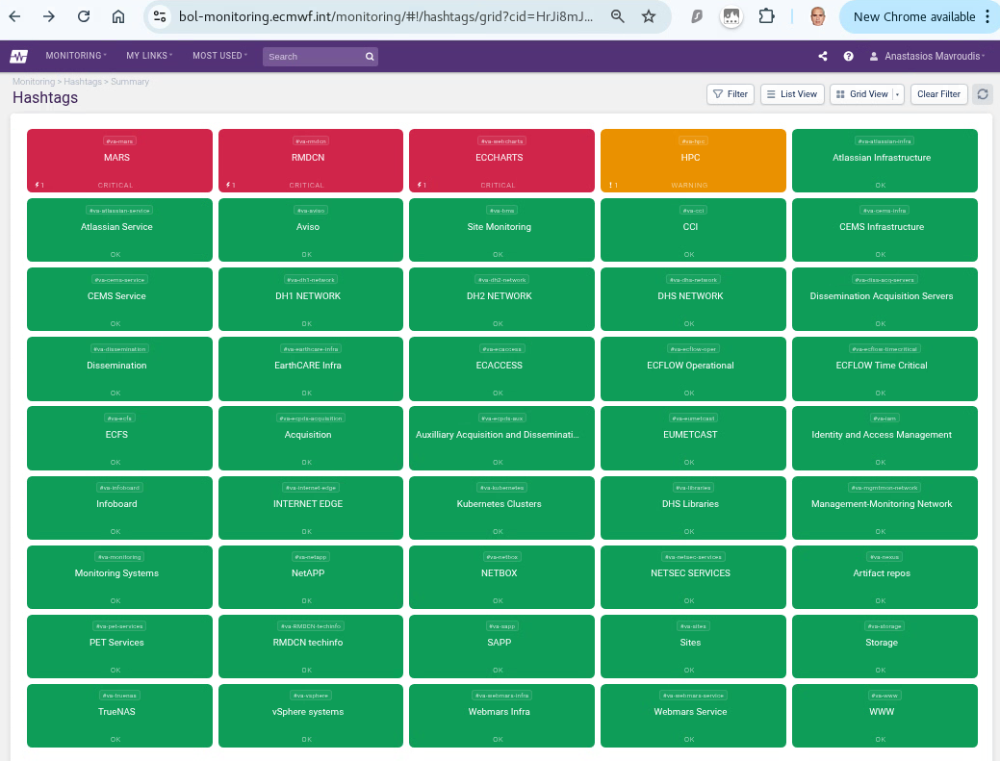

   Comprehensive monitoring tool for all operational services and infrastructure with a simple color-coded health status.

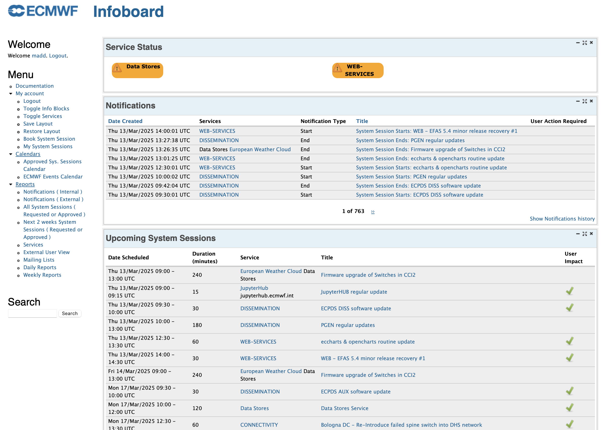

   Infoboard with announcements of system sessions and potential service degradations.

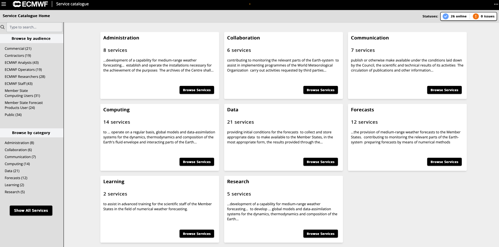

   New interface portal which will serve as gateway to all other services' monitoring in the near future.

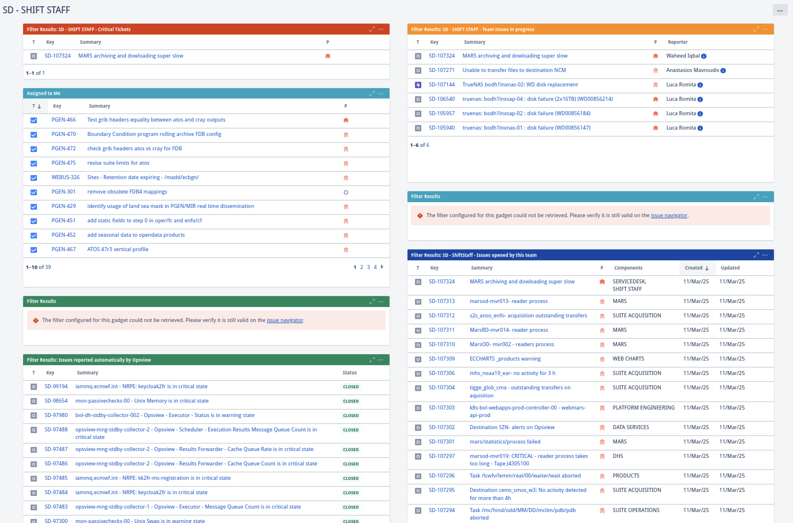

   Shows JIRA tickets from users of importance to the shift teams.

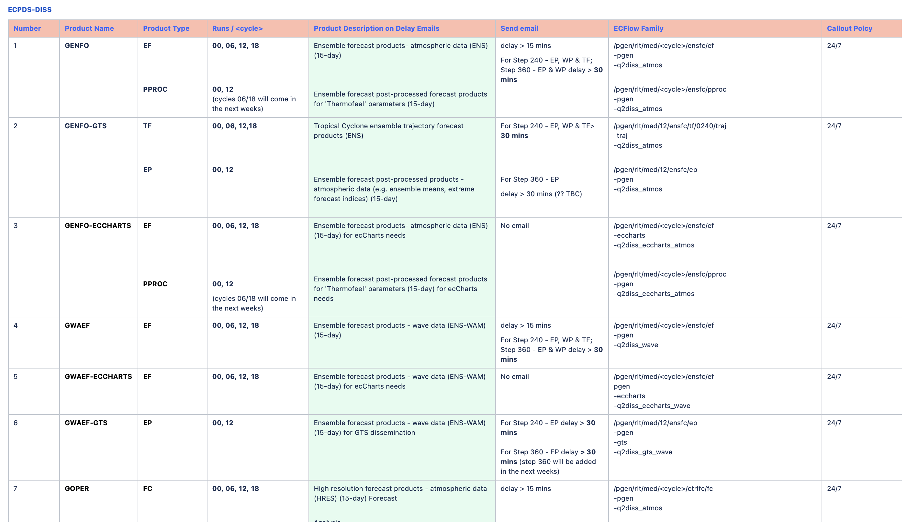

   Confluence page references for detailed suite documentation.

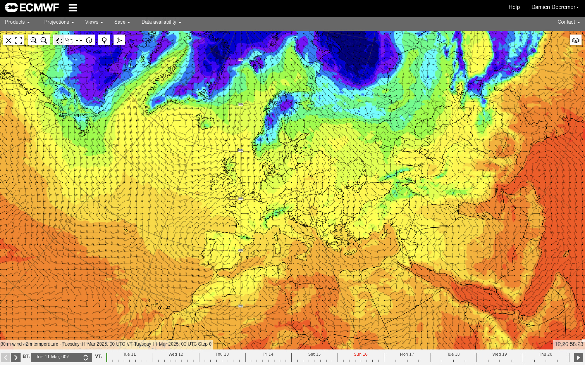

   The ecCharts service.

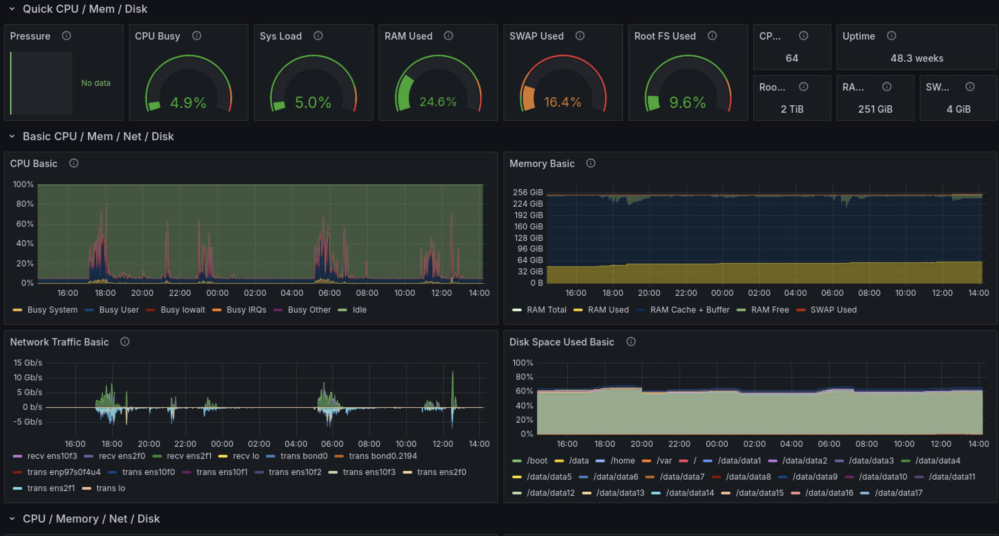

   Splunk dashboards for the full ECPDS system health.

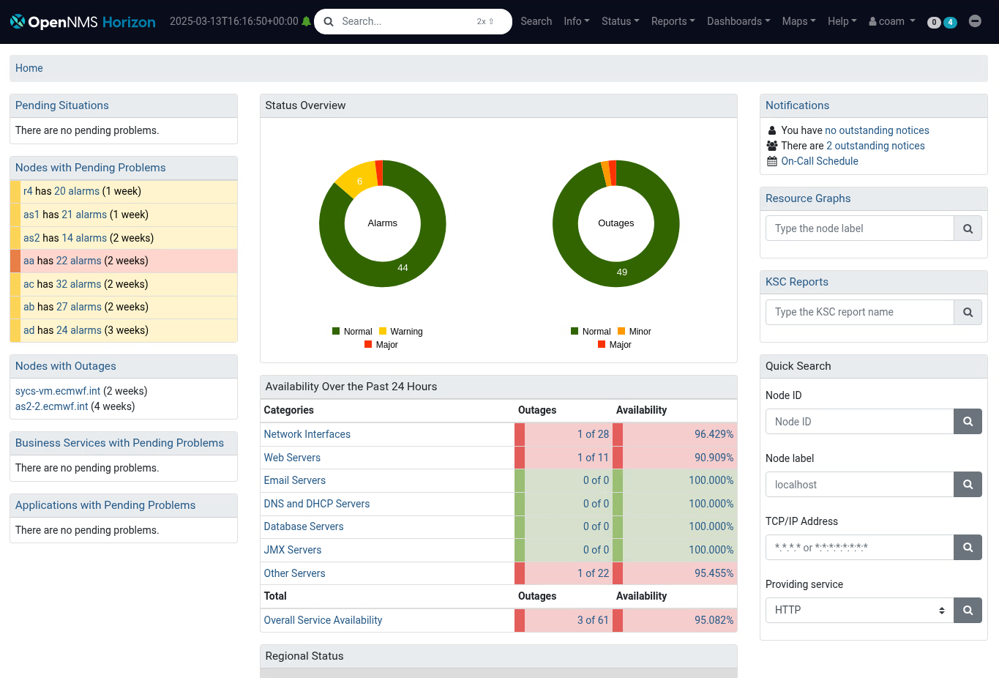

   Monitoring of the network's component health.

Task purpose, criticality, and failure procedures
-------------------------------------------------
Document what each task does, how critical it is and what to do when it fails. Each task
within the suite should be documented with the following information:

- **Task Name**: A clear and descriptive name.
- **Function**: A brief description of what the task does.
- **Criticality**: An assessment of how critical the task is to the overall suite.
- **Failure Procedures**: Detailed instructions on what to do if the task fails, including:

  - Common failure modes and their causes.
  - Steps to diagnose and resolve the issue.
  - Contact information for further assistance if needed.

Clear naming of families and tasks
----------------------------------
Families and tasks should be named clearly and descriptively to reflect their function. Naming conventions should be
consistent and follow these guidelines:

- **Families**: Use short, descriptive names that indicate the purpose of the family (e.g., `setup`, `admin`, `barrier`, `lag`).
- **Tasks**: Task names should clearly indicate their function without unnecessary abbreviation.
  Ensure that the granularity of tasks is appropriate, balancing runtime efficiency with clarity of purpose.