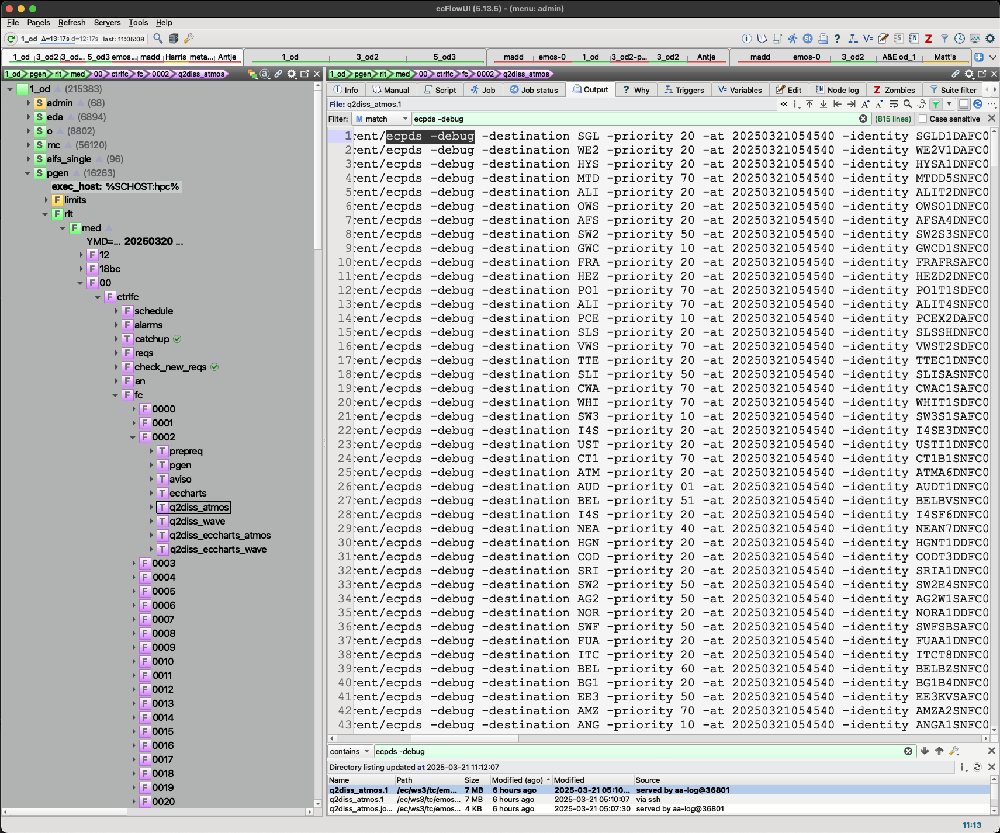
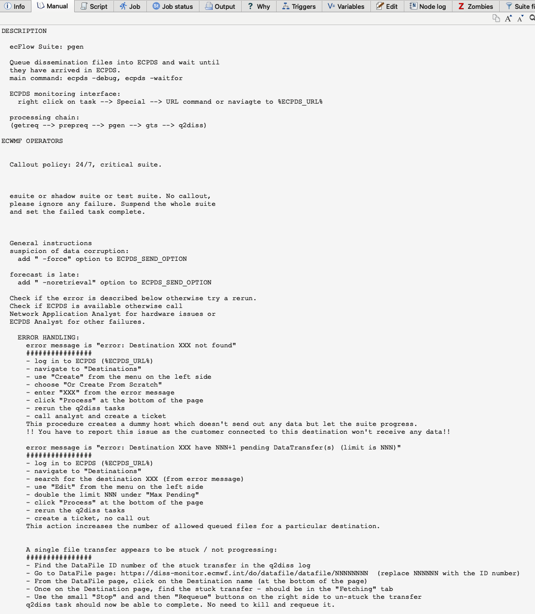
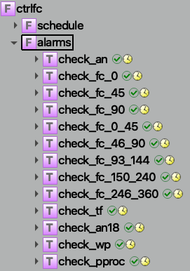

Documentation
=============

Documenting the suite for different audiences
---------------------------------------------

For operators (1st line)
~~~~~~~~~~~~~~~~~~~~~~~~
The primary documentation for operators is found in the ecFlow manual pages. This documentation should include:

- Step-by-step instructions for common operational tasks.
- Troubleshooting guides for common issues.
- Contact information for 2nd line support - link to oncall page.

For analysts (2nd line)
~~~~~~~~~~~~~~~~~~~~~~~
Analysts will find relevant documentation in both the ecFlow manual pages and the repository README and code.
This should include:

- Detailed descriptions of the suite's functionality.
- Examples of typical analysis workflows.
- Code snippets demonstrating how to interact with the suite programmatically.

For developers
~~~~~~~~~~~~~~
Developers should refer to the repository README and code comments for comprehensive documentation. This should cover:

- Code architecture and design principles.
- Guidelines for contributing to the codebase.
- Detailed comments within the code explaining complex logic and algorithms.

For scientists
~~~~~~~~~~~~~~
Scientists require a high-level description of the suite, which should be documented on a Confluence page.
This should include:

- An overview of the suite's purpose and capabilities.
- Descriptions of key scientific algorithms and models used.
- Links to relevant research papers and technical documentation.

Operators perspective
---------------------
It has to be known that operators who monitor and support our operations 24/7 cannot have full understanding of the
operational components that are running. They have limited visibility on the tasks run and can only consult higher level
dashboards and GUIs to issue warnings and call out relevant analysts for remediary action. One should keep this into account when designing suites to be as self-explanatory as possible and simple in structure and provide simple, but precise instructions in the man pages. Here follows a few examples of such dashboards and GUIs.

.. figure:: _img/ecflow.png
   :alt: ecFlow
   :align: center
   :width: 200%

   `ecFlow user interface <https://github.com/ecmwf/ecflow/tree/main>`_ that operators use to monitor and control suite tasks. This is the main interface of interaction during cycle runs 4x a day.
   In order to link this interface with dashboards below, a suite must use labels, man pages and verbosity levels in logs that help linking to what is seen. 

For example, the following monitoring page gives granular overview of single destinations ECMWF sends data to 4x per day. 
Using labels or verbose logs can help operators to find the exact task that is delayed or failing and needs attention.

.. figure:: _img/xdiss_monitor.png
   :alt: Dissemination Monitor
   :align: center
   :width: 200%

   Overview of dissemination destinations and their status.

   The verbosity of logs can be tuned to the right level of granularity to help operators and analysts to quickly link with dissemination monitor.

.. figure:: _img/service_status.png
   :alt: Service Status
   :align: center
   :width: 200%

   High-level dashboard for various `services status <https://status.ecmwf.int>`_. If a particular service is affected, several parts of suites using those services will likely fail. The design of suites should be such that they can be easily linked to the services status page, for example in the man pages:

   A man page example with links and instructions to other dashboards and detailing which services or other tasks dependencies a task has.

.. figure:: _img/confluence.png
   :alt: Confluence Documentation
   :align: center
   :width: 200%

   Additional high-level documentation and links to suites can be hosted elsewhere, e.g. on a dedicated `confluence. <https://www.atlassian.com/software/confluence>`_ which describes the responsibility of the various tasks and their callout policy throughout the operational suites.

.. figure:: _img/eccharts.png
   :alt: ecCharts Interface
   :align: center
   :width: 150%

   The `ecCharts <https://eccharts.ecmwf.int>`_ service.

For other services, operators look at the end-user interfaces to check the suites output are as expected. Here too, clear task naming will help operators to identify where silent failures or other problems occured.

Other dashboards give hardware or network health overviews. The suite can show where tasks are late and operators can link the delay with sytem health through these dashboards.
Any type of problem occuring in operations like I/O contentions, network latency, hardware failures, etc. can be linked to late flags in the suite. In operations, it's customary to use check alarms in situations where the model is run at fixed times every day.

   Check alarms implemented through cron jobs help to warn operators when a task is late. The statistics or runtimes can be either fixed times every day or be based on persistence runtimes statistics kept on the HPC. 

.. figure:: _img/splunk_ecpds.png
   :alt: Splunk Web API
   :align: center
   :width: 1000%

   `Splunk <https://www.splunk.com>`_ dashboards for the dissemination system health.

.. figure:: _img/open_nms.png
   :alt: HPC Open NMS
   :align: center
   :width: 200%

   Monitoring of the `network's component health <https://www.opennms.com>`_.

Task purpose, criticality, and failure procedures
-------------------------------------------------
Document what each task does, how critical it is and what to do when it fails. Each task
within the suite should be documented with the following information:

- **Task Name**: A clear and descriptive name.
- **Function**: A brief description of what the task does.
- **Criticality**: An assessment of how critical the task is to the overall suite.
- **Failure Procedures**: Detailed instructions on what to do if the task fails, including:

  - Common failure modes and their causes.
  - Steps to diagnose and resolve the issue.
  - Contact information for further assistance if needed.

Clear naming of families and tasks
----------------------------------
Families and tasks should be named clearly and descriptively to reflect their function. Naming conventions should be
consistent and follow these guidelines:

- **Families**: Use short, descriptive names that indicate the purpose of the family (e.g., `setup`, `admin`, `barrier`, `lag`).
- **Tasks**: Task names should clearly indicate their function without unnecessary abbreviation.
  Ensure that the granularity of tasks is appropriate, balancing runtime efficiency with clarity of purpose.