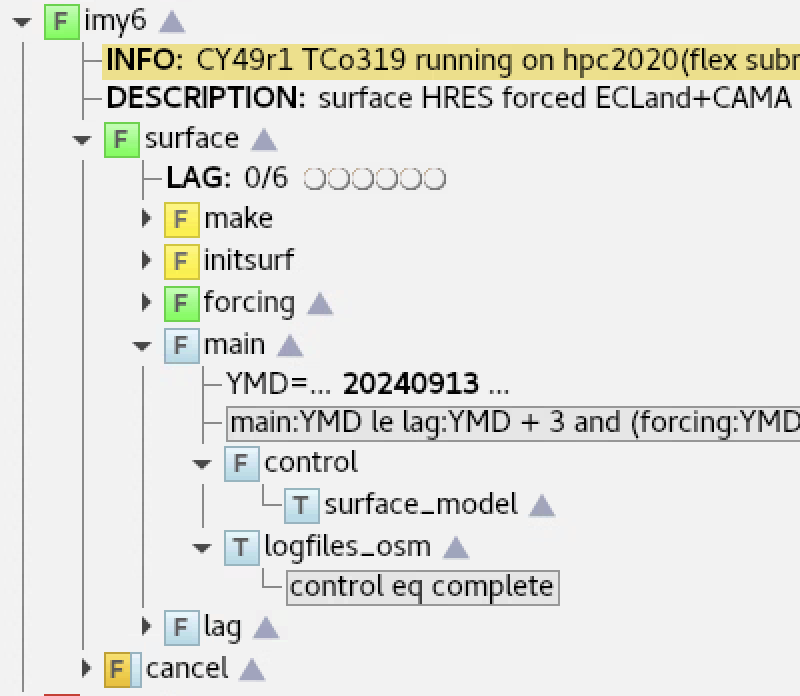

Structure and families
======================

Families are used to structure the tasks of the suite, providing both a visual and
execution hierarchy in ecFlow. These family nodes can be expanded or collapsed to
reveal or hide the part of the suite. They can have their own documentation and triggers or can be
referenced in other triggers. It is important to use descriptive but concise names for
families to aid navigation of the suite. Suites should be laid out in a consistent and
logical structure, with families grouping related tasks for clarity and to simplify the
required triggers.

Standard families
-----------------
Due to the common tasks required in most suites, there are some standard families that
most suites should include with the following names widely used at ECMWF:

  - **setup/make/init**: tasks to install the suite's :doc:`software <software_dependencies>` and data dependencies
  - **admin**: tasks for suite maintenance and other manually run tasks or toggles
  - :ref:`barrier <Barrier>`: a family to hold the next execution date for operational suites
  - one or several families that contain the main, time-critical tasks of the suite (there is no accepted standard name, but **main** is often used)
  - **lag**: tasks that lag :doc:`behind time-critical tasks, such as archiving and cleaning <time_criticality>`
  - **cancel**: tasks to clean up the suite after it has finished

*Figure*: Example of a well-structured suite with standard families, here an IFS surface experiment suite.

Looping families
----------------
Most suites loop over dates for the forecast or other analysis. This looping structure is
achived with the :ecflow-docs:`repeat functionality of ecFlow <glossary.html#term-repeat>`.
*Repeats* move foreward with triggers and are often linked to the a barrier YMD variable.
*Repeat families* can be split or "unrolled" to improve throughput. Because the next repeat of e.g. the "main" family
cannot begin until the previous one has finished, critical-path throughput may be improved byone of two approaches:

  - Splitting parts that run sequentially to cycle independently (e.g. an analysis and the forecast from it generating
    the first guess for the next one).
  - "Unrolling" the repeat so that alternate cycles can overlap. Excessive unrolling can make the suite hard to manage,
    but separate repeating families for e.g. 0Z and 12Z cycles when running two cycles per day is clean and effective.

Administrative or manually-triggered tasks
------------------------------------------
Manually-run administrative tasks should be included in the suite where appropriate. They
are often grouped in the **admin** or **setup** family, depending on their scope, but can also be placed in other
families closer to related tasks. These families should have the ``defstatus complete`` so that they only run when
manually executed. Other tasks may nevertheless have triggers on them, if they need to wait in the event that they
*are* being run. Examples of such tasks might be:

  - Remove output files that would otherwise be reused rather than regenerated.
  - Apply a workaround for a known failure type.

Configuration structure
-----------------------
ecFlow variables are cascading, i.e. they can be defined at any node level with the lowermost node taking precedence.
This means families can be used to apply configuration settings to all tasks within them, or to override settings that
are inherited from higher up in the suite. This is particularly useful for configuration that may need to be changed
"on the fly" without editing the suite definition. This avoids the need to "hack" deployed scripts (either on the
filesystem, or via the ecFlow "Edit" tab) for common on-the-fly changes and workarounds.
These variables should be defined at the highest relevant level in the suite and inherited - making it easy to change
suite-wide, but still possible to override on individual families or tasks when necessary.
For boolean configuration switches, it may be convenient to use ecFlow events on a ``defstatus complete`` task in the
**admin** family as toggles and used within triggers.

*Figure*: Example of a toggles task for suite-wide switches. Here the GloFAS suite.

Execution structure
-------------------
As each task of a suite generates a separate compute job, the structure of the suite should reflect the most efficient
way to run these jobs in terms of parallelism and optimal data chunking. For example, the retrieval of data from MARS
should be chunked in a way to optimise the MARS request, rather than an according to the chunking used
to process the retrieved data.

Triggers are used to control the flow of the suite, ensuring that tasks are run in the correct order and at the correct time.
Triggers should be kept as simple as possible while ensuring the required sequencing and timeliness.
Where possible, triggers between separate families should be at the
family level, with one family waiting for another to complete, rather
than relying on detailed knowledge of individual tasks within another.
Exceptions to this are likely to be required in some cases, to ensure
that the critical path is kept as short as possible by starting `parts` of
one family as soon as `those parts of the other it actually depends on`
have completed. Nevertheless, such optimisations increase complexity, and should not be
applied unnecessarily off the critical path.

Limits should be used as necessary to prevent overloading HPC, ecFlow and other resources.
Where a suite can potentially submit a large number of tasks at once,
but this is not essential for timeliness or throughput on the critical
path, ecFlow limits should be used to throttle the number which are
submitted or running at any one time.
This is preferable to artificially `sequencing` independent tasks with
triggers, as it allows flexible control of the level of parallelism.
This is particularly important for tasks that are off the critical path
and rely on "bottleneck" services like archivng.
